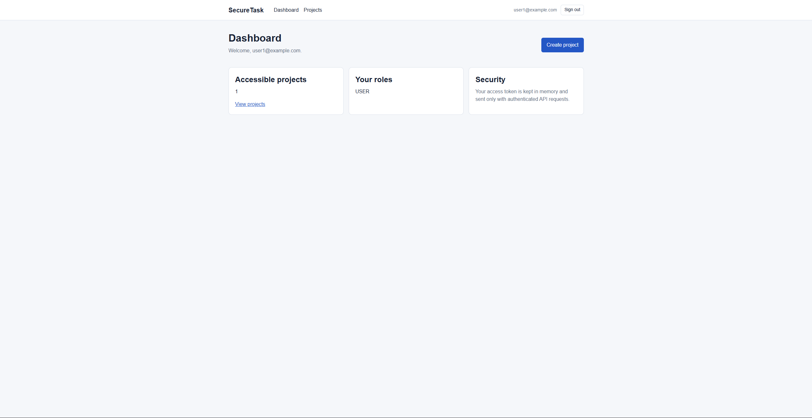
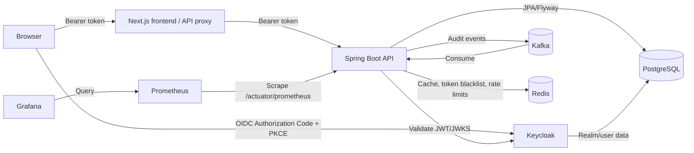
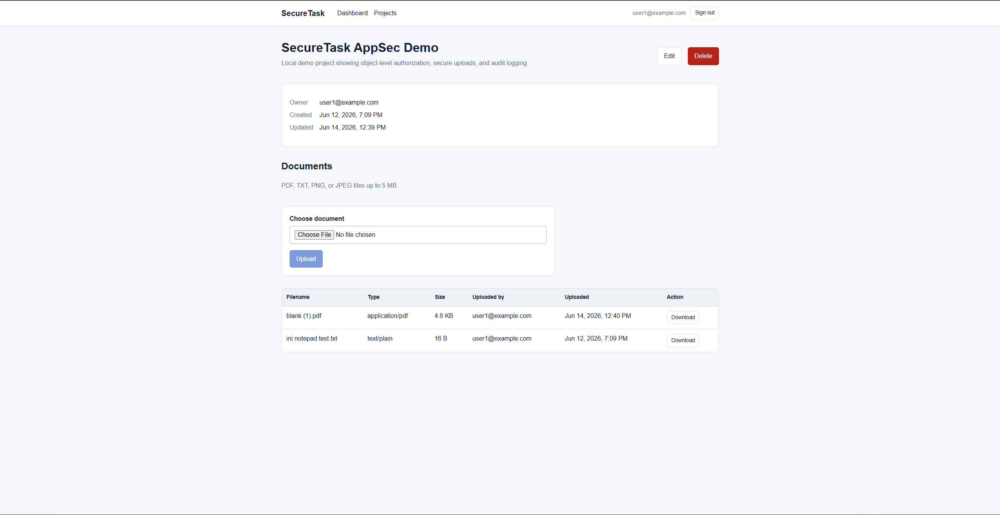
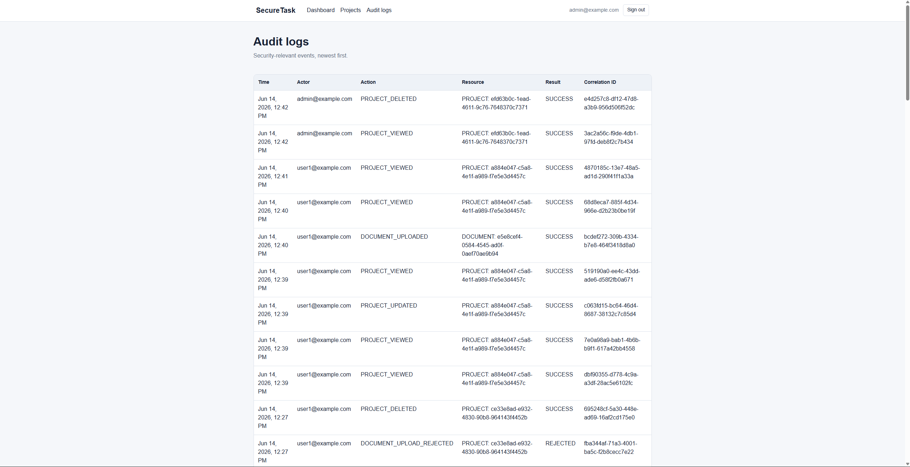

# distributed-auth-platform

distributed-auth-platform is a local portfolio application demonstrating
security controls in a full-stack system built with Next.js, Spring Boot,
PostgreSQL, and Keycloak.

The demo includes OAuth2/OIDC login with PKCE, Project CRUD, object-level
authorization, audit logging, controlled document upload/download,
Swagger/OpenAPI, security headers, and GitHub Actions security checks.



## Quick Start

Prerequisites: Docker Desktop with Docker Compose and Windows PowerShell 5.1 or
PowerShell 7.

From a fresh clone:

```powershell
Copy-Item .env.example .env
docker compose up -d --build
```

The example environment values are for local demonstration only. Change the
PostgreSQL and Keycloak administrator passwords in `.env` before using the
repository outside an isolated local machine.

After the containers finish starting, open:

- Frontend: [http://localhost:3000](http://localhost:3000)
- Swagger UI: [http://localhost:8080/swagger-ui.html](http://localhost:8080/swagger-ui.html)
- Keycloak: [http://localhost:8081](http://localhost:8081)
- Prometheus: [http://localhost:9090](http://localhost:9090)
- Grafana: [http://localhost:3001](http://localhost:3001) (`admin` /
  `GRAFANA_ADMIN_PASSWORD` from `.env`)

Run the automated reviewer checks:

```powershell
powershell -ExecutionPolicy Bypass -File .\scripts\smoke-test.ps1
```

The [smoke-test script](scripts/smoke-test.ps1) verifies authentication,
object-level authorization, document restrictions, and audit-log access. It
uses temporary data, cleans up even after a failed check, prints no tokens or
passwords, and exits nonzero when a control does not behave as expected.

Keycloak imports the `securetask` realm only when it does not already exist.
If an older local realm is present, remove the local Docker volumes and start
again only when deleting local demo data is acceptable.

## Architecture



The backend both publishes to and consumes from Kafka: services publish an
`AuditEvent` to the `audit-events` topic instead of writing audit rows
directly, and a consumer in the same application reads that topic and
performs the actual write to PostgreSQL (see
[Kafka-based audit event streaming](docs/05-audit-logging.md) for why).
Redis backs three independent features - the project-list cache, the JWT
revocation blacklist, and the per-user rate limiter - not a single cache
layer.

Metrics: the backend exposes Prometheus-format metrics at
`/actuator/prometheus` (unauthenticated - see
[Local-Demo Limitations](#local-demo-limitations)); Prometheus scrapes it
every 15s; Grafana's "distributed-auth-platform Backend Overview" dashboard (provisioned
from [`infra/grafana/provisioning/dashboards/backend-overview.json`](infra/grafana/provisioning/dashboards/backend-overview.json)
on startup, not built by hand) shows request rate, p95 latency, and error
rate. Every backend log line is structured JSON (Elastic Common Schema) and
carries the `X-Correlation-ID` request header as a `correlationId` field, so
a single request's log lines can be traced by that ID even under concurrent
traffic.

## Kubernetes (Demonstration)

**This section is optional and is not required to try the project.**
docker-compose above is the only supported way to run distributed-auth-platform locally.
The manifests under [`deploy/k8s/`](deploy/k8s/) exist to demonstrate
deployment readiness - that the same containers can run under a real
orchestrator, with health probes, startup ordering, and service discovery -
not as a second way to develop against.

The GitHub Actions `deploy` job in the
[security workflow](.github/workflows/security-ci.yml) proves this
automatically on every push/PR: it builds the backend and frontend images,
spins up a disposable [kind](https://kind.sigs.k8s.io/) (Kubernetes-in-Docker)
cluster on the runner, loads the images into it (no registry, no cloud
account, no credentials of any kind), applies every manifest in
`deploy/k8s/`, waits for all pods to become ready, and smoke-tests the
backend health endpoint and the frontend through `kubectl port-forward`. The
cluster and images are discarded when the job finishes.

Known, intentional simplifications versus the compose setup (all a
consequence of this being a demo, not a production manifest set):

- No `Secret` objects - every value is the same intentionally-committed demo
  credential already in `.env.example`, kept in `ConfigMap`s for simplicity.
  A real deployment should use `Secret`s or an external secret manager.
- No `PersistentVolumeClaim`s - Postgres and Redis data do not survive a pod
  restart. Fine for a cluster that's recreated per CI run or per local demo
  session; not fine for anything meant to keep data.
- The frontend's `NEXT_PUBLIC_*` values are baked into the image at
  `docker build` time (a Next.js constraint, not a Kubernetes one) - changing
  `deploy/k8s/frontend/configmap.yaml` alone has no effect; the image must be
  rebuilt with matching `--build-arg` values.
- `deploy/k8s/ingress.yaml` requires an ingress controller (e.g.
  `ingress-nginx`) that kind does not install by default. CI's smoke test
  uses `kubectl port-forward` instead, which proves the same
  Service-to-Pod routing with far less setup; the Ingress manifest is
  provided for anyone who installs a controller locally.

To run it yourself locally with [kind](https://kind.sigs.k8s.io/) and
[kubectl](https://kubernetes.io/docs/tasks/tools/#kubectl):

```powershell
kind create cluster --name securetask
docker build -t securetask-backend:local ./backend
docker build `
  --build-arg NEXT_PUBLIC_KEYCLOAK_URL=http://localhost:8081 `
  --build-arg NEXT_PUBLIC_KEYCLOAK_REALM=securetask `
  --build-arg NEXT_PUBLIC_KEYCLOAK_CLIENT_ID=securetask-frontend `
  --build-arg NEXT_PUBLIC_API_PROXY_PATH=/api/backend `
  -t securetask-frontend:local ./frontend
kind load docker-image securetask-backend:local --name securetask
kind load docker-image securetask-frontend:local --name securetask
kubectl apply -f deploy/k8s/namespace.yaml
kubectl create configmap keycloak-realm-import -n securetask `
  --from-file=infra/keycloak/realms/securetask-realm.json `
  --dry-run=client -o yaml | kubectl apply -f -
kubectl apply -R -f deploy/k8s/
kubectl -n securetask rollout status deployment/backend
kubectl -n securetask port-forward svc/frontend 3000:3000
```

If the manifest's `image:` fields (`securetask-backend:ci` /
`securetask-frontend:ci`) don't match the tags above, edit
`deploy/k8s/backend/deployment.yaml` and
`deploy/k8s/frontend/deployment.yaml` to `:local`, or tag your local builds
`:ci` instead.

## Demo Credentials

These accounts and passwords are intentionally committed for the local demo.
Do not reuse them in a shared or production environment.

| Account | Password | Role | Demonstrates |
| --- | --- | --- | --- |
| `user1@example.com` | `User123!` | `USER` | Project ownership and document handling |
| `user2@example.com` | `User123!` | `USER` | Cross-user access denial |
| `admin@example.com` | `Admin123!` | `ADMIN` | Administrative project and audit access |
| `auditor@example.com` | `Auditor123!` | `AUDITOR` | Read-only audit review |
| `manager@example.com` | `Manager123!` | `MANAGER` | Additional demo role |

## Demo Flow

1. Sign in as `user1@example.com`, create a project, and upload an allowed
   `.txt`, `.pdf`, `.png`, `.jpg`, or `.jpeg` document.
2. Sign out and sign in as `user2@example.com`. Attempts to access user1's
   project are rejected with `403 Forbidden`.
3. Sign in as `admin@example.com` or `auditor@example.com` and review the
   recorded events on the Audit Logs page.
4. Run the smoke test to repeat the core positive and negative security checks
   non-interactively.





## Security Design

- The browser uses the public `securetask-frontend` OIDC client with
  Authorization Code Flow and S256 PKCE.
- Access tokens are kept in memory and are not stored in `localStorage`.
- The backend validates bearer JWTs and enforces project ownership and
  role-based access independently of the frontend.
- Uploads are limited to 5 MB, restricted by extension, stored under randomized
  names, and checked against path traversal.
- Audit records exclude passwords, tokens, secret keys, file content, and full
  request bodies.
- The local-only `securetask-smoke-test` Keycloak client is separate from the
  browser client. Direct access grants remain disabled for
  `securetask-frontend`.
- Frontend and backend responses include a localhost-compatible security-header
  baseline. The CSP is intentionally not presented as production-grade.

Detailed design and limitations:

- [Architecture](docs/01-architecture.md)
- [Threat model](docs/02-threat-model.md)
- [Security controls](docs/03-security-controls.md)
- [OWASP Top 10 2025 and API Security Top 10 2023 mapping](docs/04-owasp-mapping.md)
- [Audit logging](docs/05-audit-logging.md)
- [Security tradeoffs](docs/06-security-tradeoffs.md)
- [AppSec demo scenarios](docs/07-demo-scenarios.md)
- [MVP project plan](docs/00-project-plan.md)

## Reviewer Checklist

- [ ] Start from a fresh clone using `.env.example`.
- [ ] Confirm the frontend redirects login to the local Keycloak realm.
- [ ] Complete the user1/user2 object-authorization demo.
- [ ] Review audit events as ADMIN or AUDITOR.
- [ ] Inspect protected operations in [Swagger UI](http://localhost:8080/swagger-ui.html).
- [ ] Run [`scripts/smoke-test.ps1`](scripts/smoke-test.ps1) and confirm all checks pass.
- [ ] Review the [AppSec documentation](docs/01-architecture.md).
- [ ] Inspect the [GitHub Actions security workflow](.github/workflows/security-ci.yml).

## Security CI

The [security workflow](.github/workflows/security-ci.yml) runs on pushes to
`main`, pull requests, and manual dispatch. It uses free tooling and performs
no deployment to real infrastructure - only a disposable, local-to-the-runner
`kind` cluster:

- Maven backend tests on Java 21
- Frontend locked install, lint, and production build on Node.js
- Gitleaks secret scanning
- Trivy high/critical dependency scanning
- Actionlint workflow validation
- Kubernetes deployment demo: builds both images, applies
  [`deploy/k8s/`](deploy/k8s/) to a `kind` cluster, and smoke-tests it (see
  [Kubernetes (Demonstration)](#kubernetes-demonstration) above)

## Local-Demo Limitations

This repository demonstrates controls; it is not a production deployment
blueprint.

- Services use plain HTTP and localhost-specific origins.
- Demo credentials and the smoke-test password-grant client are intentionally
  local-only.
- Secrets are supplied through a local `.env` file rather than a secrets
  manager.
- Uploaded files use local filesystem storage without malware scanning.
- PostgreSQL and Keycloak run with development-oriented Docker configuration.
- The CSP permits sources needed by the localhost frontend, Keycloak, and
  Swagger UI; production should use HTTPS and deployment-specific,
  nonce/hash-based policies.
- Audit logs have no external retention, alerting, or tamper-evident storage.
- `/actuator/prometheus` is unauthenticated (permitted alongside the health
  endpoints) so local Prometheus can scrape it without a scrape credential;
  a real deployment would put it behind network policy or a scrape-only
  token instead of exposing it openly.
- Prometheus and Grafana run without persistent storage or alerting rules
  configured - metrics reset on container recreation, and there's no
  alertmanager.
- Availability, backup, and key-rotation controls are outside this demo's
  scope.

## Repository Layout

```text
backend/          Spring Boot resource server
frontend/         Next.js TypeScript application
infra/keycloak/   Local Keycloak realm import
infra/prometheus/ Prometheus scrape config
infra/grafana/    Grafana datasource/dashboard provisioning
deploy/k8s/       Kubernetes manifests (deployment-readiness demo, see above)
scripts/          Reviewer smoke test
docs/             Architecture and AppSec documentation
.github/workflows Security CI
```
