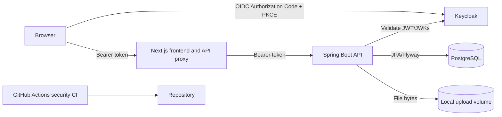

# Architecture

## Purpose

distributed-auth-platform is a local portfolio application that demonstrates authenticated
project management, object-level authorization, controlled document handling,
and security audit logging. It is not a production reference architecture.

## Components

| Component | Responsibility |
| --- | --- |
| Next.js frontend | Browser UI, Keycloak login/logout, token refresh, and a same-origin API proxy |
| Keycloak | Local OAuth 2.0/OpenID Connect provider, demo users, and realm roles |
| Spring Boot backend | JWT validation, API authorization, Project CRUD, document handling, and audit events |
| PostgreSQL | Project metadata, document metadata, and audit records; Keycloak also uses PostgreSQL |
| Local document volume | Uploaded file bytes under the configured `DOCUMENT_STORAGE_PATH` |
| GitHub Actions | Backend tests, frontend lint/build, secret scanning, and dependency vulnerability scanning |

## Main Data Flows

1. The browser authenticates with the public `securetask-frontend` Keycloak
   client using Authorization Code Flow and S256 PKCE.
2. The Keycloak JavaScript adapter keeps access tokens in memory and refreshes
   them before API calls.
3. The browser sends the bearer token to the Next.js `/api/backend` proxy. The
   proxy forwards selected headers and request data to `/api/v1` on the backend.
4. Spring Security validates the JWT issuer and signature and maps Keycloak
   realm roles to Spring authorities.
5. Controllers apply role checks; services enforce project ownership or
   administrator access before object operations.
6. PostgreSQL stores projects, audit records, and document metadata. Uploaded
   bytes are stored separately with randomized server-side filenames.

## Trust Boundaries

- **Browser to Keycloak:** credentials and identity sessions are handled by
  Keycloak, not by application code.
- **Browser to application:** bearer tokens and untrusted input cross this
  boundary.
- **Next.js to Spring Boot:** the proxy is a transport layer; the backend
  remains the authorization enforcement point.
- **Backend to persistence:** the backend controls database queries and local
  file paths.
- **Repository to GitHub Actions:** workflow jobs execute repository code and
  third-party actions/tools with read-only repository permissions.

## Local-Demo Limitations

- Docker Compose uses Keycloak development mode and local HTTP endpoints.
- Demo credentials are committed and intentionally non-secret.
- PostgreSQL and uploaded files rely on local Docker volumes or host storage;
  no application-level encryption-at-rest control is implemented.
- The application has no reverse proxy, WAF, rate limiter, malware scanner,
  centralized log platform, backup design, or production deployment.

